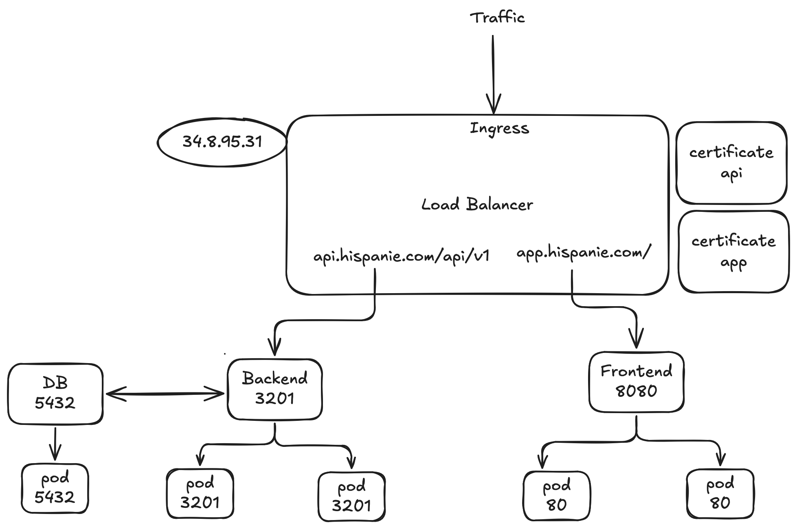

# Hispanie kubernetes deploy apps

This repository contains Kubernetes deployment configurations for the **Hispanie** application, comprising a PostgreSQL database, a Python backend, and a React frontend.

## 📁 Project Structure

The repository includes the following Kubernetes manifests:

- `postgres-deployment.yaml`
- `postgres-service.yaml`
- `postgres-pvc.yaml`
- `backend-deployment.yaml`
- `backend-service.yaml`
- `frontend-deployment.yaml`
- `frontend-service.yaml`
- `ingress.yaml`
- `api-certificates.yaml`
- `app-certificates.yaml`

These files define the deployments, services, ingress, and certificates necessary for the application.

## 🚀 Deployment Instructions

### 1. Create External IP Address (Google Cloud)

To set up an external IP address for the application:

```bash
gcloud compute addresses create hispanie-ip --global
```

### 2. Run configuration

```bash
kubectl apply -f postgres-deployment.yaml
kubectl apply -f backend-deployment.yaml
kubectl apply -f frontend-deployment.yaml

kubectl apply -f postgres-service.yaml
kubectl apply -f backend-service.yaml
kubectl apply -f frontend-service.yaml

kubectl apply -f certificates.yaml
kubectl apply -f ingress.yaml
```

### 3. Check cluster

```bash
kubectl get deploy,svc,po,ingress
```

### 4. Delete all configuration

```bash
kubectl delete -f postgres-deployment.yaml
kubectl delete -f backend-deployment.yaml
kubectl delete -f frontend-deployment.yaml

kubectl delete -f postgres-service.yaml
kubectl delete -f backend-service.yaml
kubectl delete -f frontend-service.yaml

kubectl delete -f certificates.yaml
kubectl delete -f ingress.yaml
```

## Basic architecture diagram


